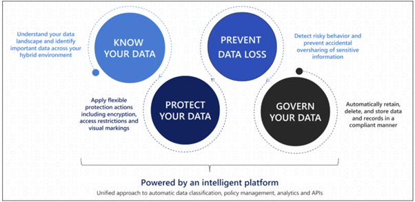
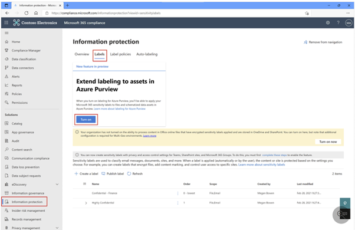
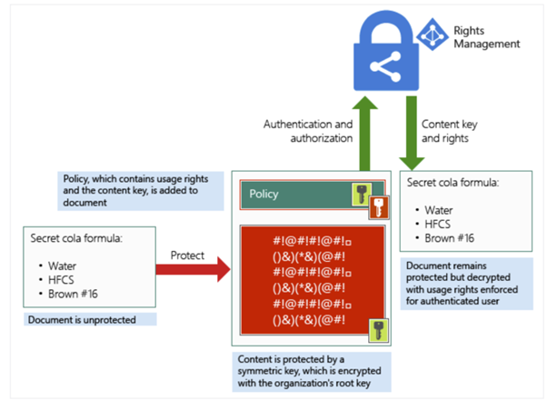
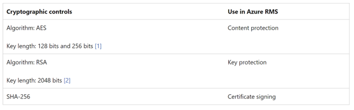

# Microsoft Purview Information Protection

Microsoft Purview Information Protection is Microsoft's offering used to discover, classify, protect, and govern sensitive information both in transit and at rest (including the data stored on premises and in cloud). The Information Protection capabilities are part of the wider Purview risk & compliance offering, accessible in the (Microsoft Purview compliance portal)[ https://compliance.microsoft.com/homepage].
Microsoft Purview Information Protection is compromised of the following standalone products and its capabilities:
* Azure Information Protection
* Microsoft 365 Information Protection, such as Microsoft 365 DLP
* Windows Information Protection
* Microsoft Defender for Cloud Apps
Enterprises dealing with sensitive information such as financial, health and other personal records etc. are required to record and govern handling of this data, accordingly classify, label and control access to it. Most of the time, this data is scattered across several on-prem servers, employee devices, cloud-native applications, third-party applications and many other. Picture below shows four major capabilities offered by Purview Information Protection which should be followed to discover this data, protect it, prevent unauthorised distribution/loss and govern it for compliance purposes. 

## Data Discovery

There are three main ways data can be discovered using Purview:
* Manually - done by users
* Sensitive Info Type - Is a purview feature used to automatically discover sensitive data based on built-in or custom declared patterns. For example, Microsoft has over 200 built-in patterns to recognise different card, healthcare, identity information used across different regions. These patterns and their definitions can be found (here)[ https://learn.microsoft.com/en-gb/microsoft-365/compliance/sensitive-information-type-entity-definitions?view=o365-worldwide].
* Machine learning - Trainable Classifiers is a Purview feature used to discover the data based on its content by examining any previous positive and negative data sample findings. More can be found (here)[ https://learn.microsoft.com/en-gb/microsoft-365/compliance/classifier-learn-about?view=o365-worldwide]
The Data Classification tab contains sensitive Info type and trainable classifier configuration. From here, users can configure custom or review existing sensitive info types and patterns used for text recognition. 

## Data Protection

Once the data has been discovered, it needs to be labelled with the appropriate sensitivity and retention labels. These labels will classify the data and therefore prepare it to be protected and governed according to compliance and business needs. 

### Sensitivity Labels

New and existing sensitivity labels can be found under the "Information Protection" tab on the compliance portal.

The following actions can be achieved by labelling the data:
* Encrypt emails, meeting invites, and documents to prevent unauthorized people from accessing this data
* Mark the content when you use Office apps, by adding watermarks, headers, or footers to emails, meeting invites, or documents that have the label applied.
* Protect content in containers  such as sites and groups when you enable the capability to use sensitivity labels with Microsoft Teams, Microsoft 365 groups, and SharePoint sites.
* Apply the label automatically to files and emails, or recommend a label.
* Set the default sharing link type for SharePoint sites and individual documents.

When configuring a sensitivity label, the following options will be presented:

#### Scope

Defines what data type labels will be applied to. As of now, there are three options available for selection: Items (includes emails and files), Groups & sites (includes Teams, O365 groups as well as Sharepoint sites) and schematised data assets (includes files and schematised data access in Data Map).

#### Protection level

Defines what action(s) the label will do. There are two options: encryption (controls who and what level of access the specified user has) and mark items (adds watermark to files). By opting for encryption, the user is presented with a encryption configuration menu in which the user can opt for following settings:
* Assign permissions now or let users decide
* User access expiration
* Allow offline access - users accessing the file need to be connected to the internet
* Assign permissions to specific groups - for example, all users in the HR group can edit and view the files, whilst every other internal user can only view file.

#### Auto-labelling for files and emails

This option provides a way to configure how the data will be discovered. As mentioned above, it's possible to discover it manually, using sensitive info type and trainable classifiers. If opted for SIT, patterns will be available for review in this configuration menu. Once a user saves the document, the label will automatically be applied.
 
#### Groups & Sites 

If the user opted for "Groups & Sites" under the scope configuration menu, this configuration will allow the user  to define the protection setting for groups and data. This includes the level of access that internal and external users will have for O365 and Teams Groups, as well as sharing policies of SharePoint sites with external users.

Once a label is configured with the above policies, it must be published . Labels can be published to all or selected users and groups. Furthermore, the following settings are available prior to publication:

* Users must provide a justification to remove a label or lover its classification. From a security perspective, this setting is recommended to be on . This setting gives more controls to compliance administrators about the data landscape and increases the effort required to bypass access controls. 
* Require users to apply a label to their emails and documents
* Require users to apply a label to their Power BI content
* Provide users with a link to a custom help page

## Encryption

Purview Information Protection uses Azure Rights Management (RMS) to encrypt sensitive files and emails. RMS uses Azure AD credentials to validate  whether the user has right access permissions to view the document. This applies to both internal and external users. The following picture shows encryption and decryption process of RMS:

Azure RMS uses the following cryptographic controls to encrypt the data:

Additionally, Azure RMS supports the following security, compliance, and regulatory requirements:
* Use of industry-standard cryptography and supports FIPS 140-2
* Support for nCipher nShield hardware security module (HSM) to store your tenant key in Microsoft Azure data centers.
* Azure Rights Management uses separate security worlds for its data centers in North America, EMEA (Europe, Middle East and Africa), and Asia, so your keys can be used only in your region.
Certification for the following standards:

* ISO/IEC 27001:2013 (./includes ISO/IEC 27018)
* SOC 2 SSAE 16/ISAE 3402 attestations
* HIPAA BAA
* EU Model Clause
* FedRAMP as part of Azure Active Directory in Office 365 certification, issued FedRAMP Agency   Authority to Operate by HHS
* PCI DSS Level 1

