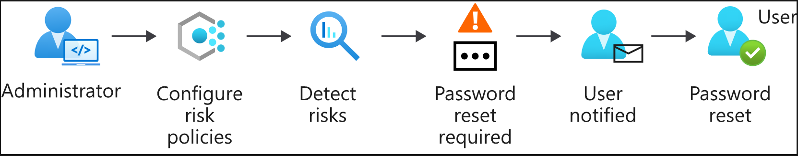
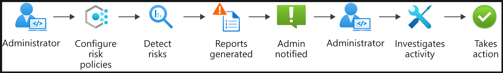
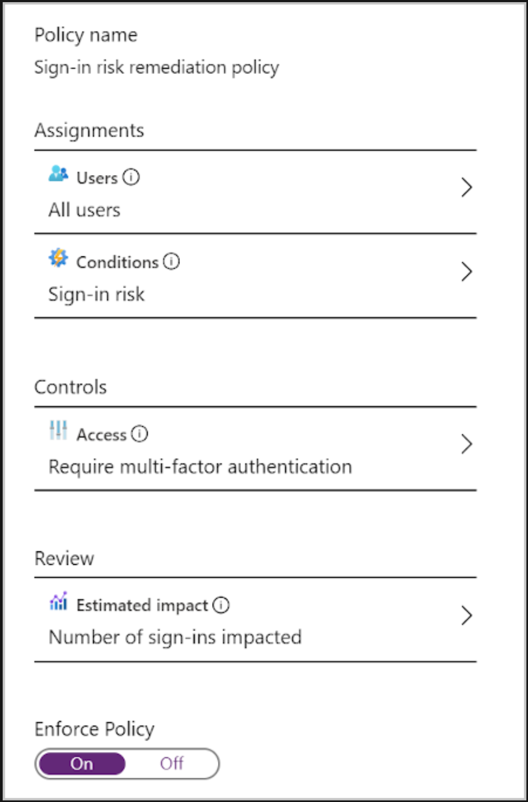

# Identity Protection

## Service Details

Service that uses Machine Learning and behavioural analysis, looking at users' login patterns, how they do it, location, MFA, etc. in an attempt to learn about user behaviours and help automate the detection of anomalous behaviour that wouldn't be easily noticeable by a human user looking at logs.
Based on documentation it uses predictive models based on analytics from Microsoft's own services such as Xbox and Microsoft account sign-ins to try to model the types of activities a regular user would perform.

Azure AD Premium P2 license is required for full access to this feature.

### Risks

There's the concept of risks: suspicious activity and actions by users when they sign in, or when they take actions after signing in. Therefore, they sit within these two broad categories:

- Sign-in risks - Identity Protection scrutinizes each authentication request to estimate the probability that a given request hasn't been performed by the expected identity owner.
- User risks - the rating of whether a user's identity/account has been compromised

As part of sign-in risks, Microsoft provides the following detection types (documentation could be found here [(List of Identity Protection risks)](https://docs.microsoft.com/en-us/azure/active-directory/identity-protection/concept-identity-protection-risks)):

- Atypical travel – for example, when two or more sign-ins occur from distant locations in an unrealistically short time period
- Anomalous token - detection based on variations from the expected type of session or refresh token lifetime or usage. Can be a noisy detection but can be useful for verification of anomalous activity
- Token Issuer anomaly - detection that points out issues with the SAML token issuer or the claims in the token
- Suspicious browser usage
  - Malware-linked IP address – for instance, if the IP address where the sign-in originates is known to have been in contact with an active bot server
  - Anonymous IP address – for instance, a sign-in originates from an anonymous IP address. Because these details can be used by attackers to hide their real IP address or location, a risk detection is raised
- Unfamiliar sign-in properties - detection that bases user sign-in behaviour based on what it sees the user do during its initial learning period once a new user is setup. Once that passes the detection will generate alerts when major deviations are noted from a user's general behaviour.
- Malicious IP address - detection based on the risk rating of a given address
- Password spray - detection based on whether the service has detected similar patterns of account bruteforcing against multiple usernames in the tenant.
- Anonymous IP address - detection on sign-ins from an anonymous VPN or Tor.
- Admin confirmed user compromised - this generates an alert if an admin has marked a user as confirmed compromised.
- Azure AD threat intelligence - detection based on suspicious activity that is based on internal or external threat intelligence sources in Microsoft.

Additionally, Azure Identity Protection has several detections that make use of the Microsoft Defender for Cloud Apps service to generate alerts. These detection types are the following:

- Suspicious inbox manipulation rules - detection that attempts to alert when it recognises new mailbox rules that can be the result of malicious activity.
- Impossible travel - for example, when two or more sign-ins occur from distant locations in an unrealistically short time period
- New country - logins from a new country that the user has not been to before.
- Activity from anonymous IP address - detection based on activity from an anonymous proxy IP range
- Suspicious inbox forwarding - detection that aims to alert on suspicious forwarding rules sending email to an external address
- Mass Access to Sensitive Files - detection that tries to profile regular user activity with OneDrive and SharePoint and alert if this gets exceeded.

Lastly, the service also has several user risk detection types:

- Possible attempt to access Primary Refresh Token (PRT) - this detection is actually supported by Microsoft Defender for Endpoint (MDE) as such unless the organisation has it integrated and enabled this will not run or create alerts.
- Leaked credentials - detection indicates if a user's credentials have been leaked. Based on Microsoft's services that check against different sources such as paste sites, dark web forums, etc...
- Azure AD threat intelligence - similar to the sign-in risk detection in the usage of known patterns of behaviour from Microsoft's services.

### Protection workflow

- Self-remediation workflow – risk policies are used to automatically respond to detected threats for you.
  - You configure a policy to decide how you want Identity Protection to respond to a particular type of risk
  - Then you choose the action to user is asked to complete (self-service password reset, MFA enforcement, etc.)

- Administrator remediation workflow – you can have admins decide how a risk should be remediated when it's been detected by your risk policies. This allows for more tailored decisions
  - Here, the admin configures risk policies
  - Policies then monitor for identity risks
  - The admin gets notified of risks in a report
  - They can view it and take appropriate action to remediate this risk (ex. Sign-in is safe, so accept the risk

### Risk policies

You configure a risk policy to decide how you want Identity Protection to respond to a particular type of risk. Do you want to block or allow access? Do you want to make users go through additional authentication before you allow access? Risk policies help you respond to risks rapidly.

**Sign-in risk policies** - A sign-in risk policy scrutinizes every sign-in and gives it a risk score. This score indicates the probability that the sign-in was attempted by the person whose credentials are used. You decide which level of risk is acceptable by choosing a threshold of low, medium, or high. Based on the risk level, you choose whether to allow access, automatically block, or allow access only after additional requirements are met.

- Specify the users this policy should target
- The conditions that must be met – such as how high a score triggers this policy
- How you want the policy to evaluate the set of conditions

An example sign-in remediation policy can be seen below:

**User risk policies** - Here, Identity Protection learns the user's normal behavioural patterns. Then, this knowledge is used to calculate the likely risk that the user's identity was compromised. Based on this risk, the admin can decide whether to allow access, block it, or allow access only after additional requirements are met such as a password reset.

**MFA registration policy** – Adds a second layer of protection to your users' identities. You can use an MFA registration policy to make sure all users are registered for MFA from the first time they use their account. You also configure this policy so you can enforce sign-in risk policies. This way, you let users self-remediate after a sign-in risk is detected.

Users must complete registration within 14 days, and they can keep skipping signing in during that period. But after the 14 days they have to complete the registration before they're allowed to sign in again. Further details on configuring it can be seen here: [(MFA registration policy)](https://docs.microsoft.com/en-us/azure/active-directory/identity-protection/howto-identity-protection-configure-mfa-policy)

### Investigate reports

Identity protection offers reports from the various policies that can be configured that can be used as part of a SOC team's investigation into possibly malicious activities. These reports are broadly split into the following high-level categories:

- Risky Users
- Risky Sign-Ins
- Risk Detections

“Risky users” reports provide information on user accounts that are considered at a certain level of risk. As part of it there is also further detail on the detections which were triggered, and it links to the risk sign-ins or activities that Identity Protection picked up and evaluated for a given user.

“Risky sign-ins” reports focus on specific sign-in events to the Azure AD estate and evaluate how those sign-ins were performed and provides the criteria for why they are considered risky. This view can be useful for checking what Conditional Access policies had been applied to the sign-in and whether the sign-in was interactive or non-interactive.

Lastly, “Risk detections” reports provide a list of all the possibly anomalous detections Identity Protection has managed to spot across the last 90 days. Each of the detections is linked to a corresponding sign-in or user risk report and can allow an analyst to start building out a picture of what happened to a given account.

The raw data from Azure AD Identity Protection can be sent to a Log Analytics workspace via a diagnostic setting for the Azure Active Directory service. Once enabled, the following tables are of interest to SOC analysts interested in using the available data as part of new or existing detection models:

- AADRiskyUsers
- AADUserRiskEvents
- RiskyServicePrincipals
- ServicePrincipalRiskEvents

If Microsoft Sentinel is used a central SIEM solution, then these data tables and the alerts generated from them can be ingested via the Sentinel data connector "Azure Active Directory Identity Protection", however it should be noted that only alerts marked as "Open" in the Identity Protection service will be sent on a recurring basis to Sentinel and any that are marked as "Closed" in the Identity Protection service directly **will not** be sent to Sentinel.

### Remediate risks and unblock users

Risk policies can have configured automated remediation activities that will be executed by the service once the risk reaches the configured threshold. These remediation options are the following:

- Self-remediation with risk policy
- Manual password reset
- Close risk detection

Self-remediation can be provided by setting up MFA flows and Self-Service Password Reset (SSPR) for the organisation. This would then help bring the identity to a safe state; however, it is important that the SSPR flow enforces 2 separate factors to verify identity before a user can have their accounts reset as otherwise it might still be possible for a malicious user to take advantage of the configuration.

#### Unblock users

User accounts can be blocked by risk policies or manually by the admin after an investigation. How these user accounts are unblocked depends on the type of risk that caused the blockage:

- Blocked because of sign-in risk – need to exclude the user from the policy, or if the admin asks the user to sign in from a familiar location or device.
- Blocked because of user risk – the admin can reset the password for the user to unblock it. The admin might also dismiss the activity identified as risky, or again exclude the user from the policy.

### Azure AD Identity Secure Score

This is not technically part of Azure Identity Protection, but it's another useful service that's related to the identity risks and helps have a better overall picture of the entire identity-related posture. It's actually a subset of the Office365 Secure Score, and more directly related to Microsoft Defender for Identity (previously known as Azure ATP).

## Assessment notes

Check if the organisation has Azure AD Premium P2 license, and if the service is enabled. The main service page will show you a series of dashboards with the most important information at a glance, such as the users which were identified as the most at-risk, based on their behaviour, or the geographical locations from which users log in, with any suspicious, impossible travel scenarios flagged.

Look at the history of risky events, locations they've been coming from, the users that are most flagged as suspicious, to start building a picture of the events surrounding the tenant. Look at any of the policies that have been already set up by the organisation and consider any improvement points. Some common ones are when it is not used at all in which case there is definite benefit in using the service to flag at least the more high-risk sign-ins or user activity in the platform. In the majority of cases, high-risk detections would likely warrant a manual review to check if they are legitimate or not. In cases like these, discuss with the IT or Security team whether they have another solution that tries to perform similar actions and discuss on how to build adequate sign-in and user risk policies, based off on their concerns.

There's a good chance that if the organisation is aware of this service, that they might be already streaming logs from Identity Protection into a SIEM (such as Sentinel). If not, then this is a point at which you should have a conversation with the organisation and check if there will be any benefit to their SOC team to do so. Identity Protection does aim to provide a consolidated view of anomalous events using automation so it might be of some benefit to most SOC teams in order to bring those activities to light and prompt a more manual investigation if something is off. This service has a very good integration with Conditional Access policies, and as such organisations can take advantage of that and enforce a minimum acceptable sign-in or user risk before accessing certain applications that authenticate through SSO. However, as it can require some fine tuning and prior work for the model to correctly ignore false positives it is likely better to use Identity Protection separate from Conditional Access policies for a 3–6-month period after starting to make active use of it. This would in turn allow organisations to see how the solution is performing and then decide what sort of risky sign-in level is acceptable for a new Conditional Access policy.

## External Links

[Microsoft - Identity Protection Overview](https://docs.microsoft.com/en-us/azure/active-directory/identity-protection/overview-identity-protection)
