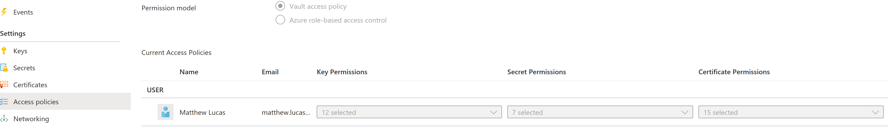

# Key Vault

## Service Details

Centralized cloud storage for everything related to sensitive secrets, keys or certificates. Commonly used by organisations to securely store access tokens and authentication secrets in a way that avoids their storage in plaintext within configuration scripts or deployment templates. The Key Vault offering can be split broadly into the following two categories:

* Standard - full access to all services provided by the solution
* Premium - same functionality but provides Hardware Security Module (HSM) protected keys.

Each Azure Key Vault has a predicatable DNS suffix that can be used to discover possible key vaults that a user has access to. The suffixes for the various Azure instances are the following:

* .vault.azure.net (regular Azure)
* .managedhsm.azure.net (regular Azure)
* .vault.azure.cn (Azure China)
* .vault.usgovcloudapi.net (Azure Gov US)
* .vault.microsoftazure.de (Azure Germany)

Respectively, this means that keys or secrets in Azure Key Vault will have a URL that follows a schema such as this (full details can be seen [here](https://docs.microsoft.com/en-us/azure/key-vault/general/about-keys-secrets-certificates)):

* {vault-name}.vault.azure.net/{object-type}/{object-name}/{object-version}

## Assessment notes

Azure Key Vaults by their nature contain highly privileged information that can often be used to move laterally between other Azure services. As such, the primary concern of any security assessment of Azure Key Vault is to ensure that access is as restricted as possible.

### Access Controls

Whilst Key Vault supports access control through Azure RBAC alone, it also possesses an additional layer of access control through the "Vault access policy" permission model. This is more commonly found and is the default for a newly created Key Vault. Where vault access policies are in place, these should be the first aspect to review as it can reveal many excessive privileges that may otherwise be missed. With "Reader" privileges, the number of Key, Secret, and Certificate permissions can be viewed in the Azure Portal as below for users, security groups and service principals:



This can be useful for quickly diagnosing blatantly over-privileged principals or situations where a large number of human users have significant and unnecessary access. Reader users can view the specific access granted to a principal through the CLI with the following command for each Key Vault:

```bash
az keyvault show
    --name "example-key-vault"
    --query 'properties.accessPolicies[*].{"PrincipalId":objectId, "permissions":permissions}'
```

When reviewing a given key vault policy configuration and RBAC role assignments, look out for the following elements:

* Human users with access to secrets in production Key Vaults.
* Principals with more permissions than should be necessary for their roles.
* Large numbers of service principals with permissive access policies.

To a certain extent, this can be audited from the Portal with Reader access just by the number of permissions assigned to a user. Getting the actual fine-grained permissions from the CLI is clearly preferable, however. Notably, the user that creates a Key Vault utilising vault access policies will automatically receive an access policy with all possible permissions. This can be a common cause for service principals or users being left with unnecessary full access to the Key Vault and all its components.

On the Azure RBAC level, it is important to note that any user with "Contributor" and above, or more specifically with the "**Microsoft.KeyVault/vaults/accessPolicies/write**" permission to a Key Vault can assign vault access policies. Essentially, this means that possessing "Contributor" access to a Key Vault grants a user the ability both to access keys and secrets and grant this access to other users -- roughly the equivalent of "Owner" to other resources. Due to the sensitivity of a Key Vault's contents, especially in production environments, these rights should be even more tightly restricted than usual.

### Network Access Controls

Key Vaults support the same standard networking controls as most Azure resources including firewall rules and options for private endpoints. Due to the sensitivity of a Key Vault's contents, any network connectivity should be restricted as much as possible. In the ideal scenario, connectivity should only be allowed through private endpoints within the corporate Azure estate. Any exceptions to this should have sufficient justification and be appropriately recorded as a possible impact to the exposed attack surface. Restricting access in such a way is important as it helps ensure that even if a set of service principal credentials are leaked, an attacker is not able to able to directly access Key Vault contents from their own infrastructure and must attempt to gain a foothold within the corporate network. This increases the complexity of an attack and adds further potential opportunities for detection.

If usage of private endpoints is not possible, then at least access should be through an explicitly allowlisted IP range, thus still enforcing some network boundary that an attacker would need to first breach before they gain access to secrets stored in Azure Key Vault.

### Backup and Recovery

Azure Key Vault does provide the capability to perform a backup of a secret, key or certificate which would export it to an offline encrypted copy that can then be stored within an Azure Storage account or in another chosen data store. However, successful decryption of the encrypted blob would require being able to restore the object into the same subscription and Azure region where it was created.

In regards to recovery and preventive controls for loss of data, Azure Key Vault has two main features that help with this:

* Soft-delete
* Purge Protection

Soft delete, once enabled, helps mitigate against accidental or malicious removals of objects in a key vault. Each deleted object stays recoverable for a given custom configured retention period or as a default for 90 days. However, even with soft delete enabled, key vaults can be forcibly purged which would make them unrecoverable even in that configured period.

As such, purge protection was designed to prevent this type of activity by removing the capability to purge a vault or object. As such, once enabled, all objects will be recoverable up to the configured retention period within the portal.

It should be noted that enabling either of the two features is an irreversable process and can't be disabled for a given key vault. As such, although these are good features to have for production Azure Key Vaults which are not expected to require any rapid removal, further consideration should be made before enabling the features for non-production instances as it can complicate automation effort in the estate.

Soft-delete will be made a default feature for all key vaults in February 2025 as outlined [here](https://docs.microsoft.com/en-us/azure/key-vault/general/soft-delete-change).

### Audit Logging

Audit logging enables record keeping of operations on the keys, secrets, and certificates. This has clear benefits in that if an attacker does get access to valid credentials to a Key Vault, attempts to actually use that access leave a trail that can be used for detection or forensics. With "AuditEvents" logging configured, attempts to access a secret create logs with "operationName" set to "VaultGet" and information about the identity used. Azure Monitor also allows logging of changes made on a resource level, such as the intentional relaxation of network access controls.

The audit logging configuration can be viewed in the "Monitoring" blade under "Diagnostic settings" ([Enable Azure Key Vault logging | Microsoft Docs](https://docs.microsoft.com/en-us/azure/key-vault/general/howto-logging?tabs=azure-cli)). "AuditEvents" records actions against secrets within the Key Vault. These should be sent to somewhere that makes sense for the use case. For instance, if there is an intention to build detections based on unusual access, then logs should go to the relevant Log Analytics Workspace.
