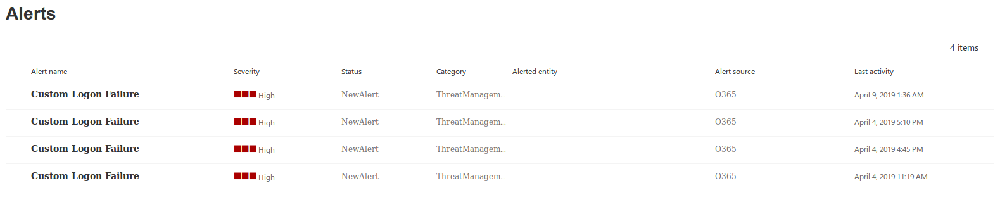
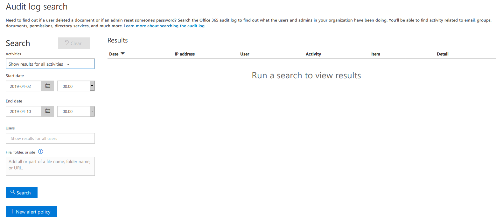
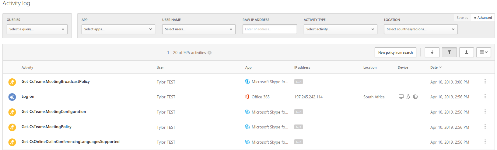
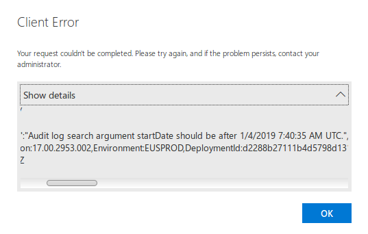

# Office 365

The prime focus areas for this article is on how to assess Office365. Testing includes checks from both CIS and NCSC baselines. When refering to (E3 and E5) it implies that both instances are effected by a given control or function.

## Need to know

This section briefly describes security related functionality within O365. Using and reviewing these functions will assist in testing O365.

### Alerts (E3 and E5)

Alerts can be used to send customised messages to administrators whenever selected actions such as failed logon happen inside the O365 instance. Alerts are defined through policies and populate a dashboard and send an alert email to the configured email account. Alerts allow administrators to be immediately notified of events within O365. The image below shows how a custom alert populates the dashboard.

### Policies (E3 and E5)

All alerts within O365 are based on policies. Policies are applied across the O365 environment to alert on misconfigurations, incident, general activity or to apply content tags and labels to Sharepoint documents. The management of these alert policies are done through the Microsoft 365 Security and Compliance Page: [https://protection.office.com/alertpolicies](https://protection.office.com/alertpolicies)

## Testing Methodology

The following sections focus on providing information on how to assess a O365 environment. Each section covers a specific tenant within Office 365 (O365).

### General Checks (E3 and E5)

Link: [https://admin.microsoft.com](https://admin.microsoft.com)

* Review the number of global administrators or users with administrative permissions: CIS states 4 accounts. Excessive number of admins should be the focus here.
* Ensure multi-factor authentication is enabled for all users in all roles, especially the privileged users: Certain user account such as meeting rooms should be excluded from this check. They cannot at this time, function differently. Depending on the requirements, configuring MFA through Azure AD Conditional Access may be a less aggressive approach e.g. MFA is required if the user is logging in from a non-compliant or non-domain-joined device.
* Ensure third-party integrated applications are not allowed: Integrated third-party apps require users to use their work account as the identity. Furthermore, "users may give applications permission to access their data could potentially give applications access to a user's email, content in sharepoint.
* Ensure Data-Loss prevention (DLP) policies are enabled : DLP policies allow Exchange and Sharepoint to track and control content within O365. For example, labeling a document as sensitive, allows administrators to quickly manange who has access to said document.
* Ensure Microsoft 365 audit log search is Enabled: Tracks user and administrator activity within the organisation. Retention period is determined by the type of O365 license (this can be confirmed by searching the logs). It could be an issue if logs are only stored for a short period of time e.g. 90 days.
* Block legacy authentication: Legacy authentication refers to the older methods of configuring authentication. Configure Azure AD Conditional Access to block legacy authentication.
* Use dedicated accounts: Limit the use or dependency on global admin accounts.
* Create admin roles with specific permissions to reduce over extensive permissions: This is to ensure that the required access is given to different administrative users.
* Configure break glass accounts (emergency access accounts): Emergency access accounts are limited to emergency or 'break glass' scenarios, situations where normal administrative accounts cannot be used.
* Disable accounts not used in the last 30 days: This limits unauthorised users' ability to access accounts that have not been used in the past month.
* Do not expire passwords (This is a NCSC specific requirement): It should not be required to renew an account's password through a policy.
* Location for privileged identities: The location of where privileged identities are anchored is important to ensure that they are as secure as possible.

### General Checks (E5 Only)

* Ensure O365 Advanced Threat Protection (ATP) SafeLinks for Office Applications are Enabled: This extends phishing protection for Office applications when opening documents that contain links.
* Ensure O365 ATP for SharePoint, OneDrive, and Microsoft Teams is Enabled: Works like anti-virus by constantly scanning for and blocking access to malicious files.
* Enable customer lockbox feature (requires E3 - SCP or E5): This will allow a Microsoft engineer to access customer content in order to fix an issue with the O365.

### General Checks (EU Specific)

* Check what authentication mechanism is used to authenticate users: Enables or disables users from accessing accounts with relevant permissions. MFA should also be implemented.
  * Note: UK Specific checks might require adhering to the Cloud Authentication with Password Hash Sync recommendation

### Exchange Online (E3 and E5)

Link: [https://outlook.office365.com/ecp/](https://outlook.office365.com/ecp/)

Ignore the following checks within Exchange Online if a client is using an alternative solution such as Mimecast, which provides similar functionality. This will require inquiring with the team responsible for managing mail within the organisation. However, do take notes that solutions such as Mimecast and Proofpoint generally act as an external email gateway that offers no protection for internal emails. Therefore, some protections within O365 will still be beneficial.

* Ensure mail transport rules do not forward email to external domains: Prevents users in one domain from forwarding email to users in a different domain.
* Ensure mail transport rules do not whitelist specific domains: Whitelisted domains are excluded from malware and link scanning.
* Ensure the Advanced Threat Protection Safe Links policy is enabled: Scans are rewrites URLs within emails to redirect through a Microsoft forwarding service.
* Ensure the Advanced Threat Protection Safe Attachments policy is enabled: Scans and reroutes emails through an anti-virus like hypervisor environment if considered malicious.
* Ensure Domain-based Message Authentication, Reporting and Conformance (DMARC) Records for all Exchange Online domains are published: Used to authenticate and trust mail senders and domains. (This can be checked through DNS)
* Ensure calendar details sharing with external users is disabled: Authenticated users outside the specific domain can view a user's calander.
* Ensure the Common Attachment Types Filter is enabled: Signature-based email attachment blocker.
* Ensure Exchange Online Spam Policies are set correctly: Notifies an administrator when a user within a tenant has been blocker for sending spam.
* Ensure that an anti-phishing policy has been created: Additional conditional controls used to block and protect users from phishing attacks.
* Ensure the Client Rules Forwarding Block is enabled: Prevents client-side rules from forwarding email to external domains.
* Ensure that Sender Policy Framework (SPF) records are published for all Exchange Domains: Allows mail servers to detect whether a message is spoofed or valid. (This can be checked through DNS)
* Ensure notifications for internal users sending malware is Enabled: Notifies an administrator if ATP detects that a user is sending known malware.
* Ensure mailbox auditing for all users is Enabled: Enables tracking of user mailbox actions such as setting up delegation.
* Ensure modern authentication for Exchange Online is enabled: Ensures strong authentication is used when setting up sessions between email clients and Exchange.
* Ensure basic authentication for Exchange Online is disabled: Disables the use of legacy emails clients that do not support modern authentication.
* Ensure that DKIM is enabled for all Exchange Online Domains: Cryptographically signs emails sent from Exchange. (This can be checked through DNS. Sometimes, it may not be implemented through O365 so verifiy through DNS to avoid false positive)
* Certificate-Based Authentication for Exchange Online: Client browsers require the use of a client-side certificate.

### Sharepoint (E3 and E5)

Link: [https://clientdomainname-admin.sharepoint.com](https://clientdomainname-admin.sharepoint.com)

These checks are focused on the sharing of documentation and the level of integration that a client has with Sharepoint.

* Ensure SharePoint Online data classification policies are set up and used: Enables categorising, tracking and protection of sensitive data within Sharepoint.
* Ensure document sharing is being controlled by domains with whitelist: Restricts document access to external third-party domains.
* Ensure expiration time for external sharing links is set: Assigns a time length restriction to anonymous access links.
* Ensure modern authentication for SharePoint applications is required: Ensures strong authentication when establishing sessions between users, applications and Sharepoint.
* Ensure that external users cannot share files, folders, and sites that they do not own: Internal users can the ability to share files with external collaborators, who with the right permissions, could share those to other external parties.

### OneDrive (E3 and E5)

Link: [https://admin.onedrive.com/?v=Home](https://admin.onedrive.com/?v=Home)

* Review link sharing settings: Advise sharing links with specific people only.
* Allow external sharing only with specific domains: Reduces the number of organisations that could theoretically gain access to the data.
* Ensure that owners can view who accessed their files: This will assists with the auditing process.
* Review sync settings: Used to control and limit syncing only to domain joined PCs.
* Review storage settings: Set days to retain files after an account has been marked for deletion.
* Disable the use of applications that do not use modern authentication: Legacy authentication has identified issues and could pose a risk to the organisation.
* Ensure a mobile application management policy has been enabled: Blocks specific functionality within a linked device.
* Enable notification settings: Email the owner when an anonymous link is created.
* Create a DLP policy: Used to control, track and prevent data leakage.
* Create a preservation policy: to retain documents for a larger period of time.

### Microsoft Intune (E3 and E5)

Link: [https://portal.azure.com/#blade/Microsoft_Intune_DeviceSettings/ExtensionLandingBlade/overview](https://portal.azure.com/#blade/Microsoft_Intune_DeviceSettings/ExtensionLandingBlade/overview)

If a client relies on Microsoft Intune for managing mobile devices, then the following section should provide some guidance on testing for the general.

* Ensure mobile device management policies are set to require advanced security configurations to protect from basic internet attacks: Additional security configurations.
* Ensure that mobile device password reuse is prohibited: Prevents users from reusing passwords.
* Ensure that users cannot connect from devices that are jail broken or rooted: Reduces likelihood of account breach through a mobile device.
* Ensure mobile devices are set to wipe on multiple sign-in failures to prevent brute force compromise: Wipes device after concurrent failed sign-in attempts.
* Ensure that settings are enabled to lock multiple devices after a period of inactivity to prevent unauthorised access: Locks device after specified period of inactivity.
* Ensure mobile device management policies are required for email profiles: Applies policies to devices that are configured with an Exchange account.
* Ensure mobile devices require the use of a password: Reduces account breach as a result of device theft.
* Certificate based authentication for mobile devices: A certificate should be installed onto the mobile device required to use the application.

Note: Microsoft Intune testing should be expanded. No advanced testing has yet been performed.

### Teams (E3 and E5)

Link: [https://admin.teams.microsoft.com](https://admin.teams.microsoft.com)

* Review number of owners inside a channel: Owners are comparable to administrators and have more permissions.
* Review the privacy level of sensitive channels: public channels don't require the owner's approval to join.
* Disable editing and removing connectors: connectors should only be altered by administrators.
* Disable removing and editing of applications: Certain settings within applications should not be configurable by users.
* Ensure that configuration profiles are created to managed devices: If using devices, can reduce attack surface.
* Review PIN length on Conference Bridge: Used to prevent brute force attacks of 2 character PINs.
* Enable the setting to ask callers to record their name before joining a meeting: To ensure parties cannot remain anonymous.
* Review content sharing settings within meeting profiles: Various features dictating what and how files can be shared in meetings.
* Disable the option for anonymous users to join a meeting: Users must be authenticated to 0365 before joining a meeting.
* Review use case for guest access: By default guests are allowed to access teams and channels.
* Review file sharing options within team settings: Disable use of third-party cloud storage parties.

### Skype For Business (E3 and E5)

Link: need to find

* Skype For Business User Policies : turn off non-archived features, only archive specific things.
* Ensure modern authentication for Skype for Business Online is enabled: Modern authentication enables Skype for Business clients to use authentication features such as smart cards, certificates and SAML identify providers.

### PowerApps (E3 and E5)

Link: [https://admin.powerapps.com](https://admin.powerapps.com)

* Review data groups within data policies: Used to prevents certain enabled applications from accessing the organisation's business relevant data.

This requires expanding and is not an exhaustive list.

### Flow (E3 and E5)

Link: [https://admin.flow.microsoft.com](https://admin.flow.microsoft.com)

* Review DLP policies within Flow: Policies used to track and control content within Flow.

This requires expanding and is not an exhaustive list.

### Detection and Logging (E3 and E5)

Logging happens across O365 within different locations. The best approach to check the level of logging within an environment, is to check whether the dashboards are collecting information. The most notable locations for log storage are as follows:

* Microsoft 365 Security Page: [https://security.microsoft.com/alerts](https://security.microsoft.com/alerts)
* Microsoft 365 Compliance Page: [https://compliance.microsoft.com/alerts](https://compliance.microsoft.com/alerts)
* Office 365 Protection Page: [https://protection.office.com/unifiedauditlog](https://protection.office.com/unifiedauditlog)

### Cloud App Security (E3 Cloud License and E5)

In the event that the O365 Cloud App Security has been activated, logging becomes more centralised. The logs generated across the above pages, are stored on the Cloud App Security page.

Link: [https://clientdomainname.portal.cloudappsecurity.com/#/alerts?resolutionStatus=eq(i:0,)](https://clientdomainname.portal.cloudappsecurity.com/#/alerts?resolutionStatus=eq(i:0,))

### Log Retention

Logs stored on O365 are retained for a limited period of time. E3 users are restricted to 90 days worth of logs whereas E5 logs are stored for a period of 365 days (one year).

### Authentication

#### Password policy

Same as the standard policy, also important for O365.

#### Multi-factor authentication

Should be enabled for everyone if possible (high-privileged users at the very least)

[https://docs.microsoft.com/en-gb/azure/active-directory/authentication/howto-mfa-userstates](https://docs.microsoft.com/en-gb/azure/active-directory/authentication/howto-mfa-userstates)

#### Conditional access

:This can reduce the burden of MFA on users -- CA can be used to, for example, drop MFA requirements for people logging in from office IPs. This is regarded as a defence-in-depth measure for remote login attempts.

[https://docs.microsoft.com/en-gb/azure/active-directory/active-directory-conditional-access-azure-portal](https://docs.microsoft.com/en-gb/azure/active-directory/active-directory-conditional-access-azure-portal)

### Sharing policies

Users should be prevented from sharing documents with external parties if this is not necessary. If external sharing is necessary, external domains should be trusted for sharing on a whitelist basis. This can be configured in the admin panels of most Office 365 services. Service-specific gotchas listed below.

#### Sharepoint

By default, Sharepoint allows external users who have been mailed sharing links to content, as a method to access those links with an account other than the one that received the mail. This could allow an attacker who had intercepted an external user's email to access the shared content with just the link.

To require external users to access content using the same account to which the link was mailed, the below setting should be enabled in the `Sharing` pane of the `SharePoint admin center`: *External users must accept sharing invitations using the same account that the invitations were sent to*

Note that this could prevent certain external users from viewing shared content depending on their setups. See the link below for more info:

[https://blogs.technet.microsoft.com/sposupport/2017/12/30/external-users-trying-to-accept-the-invitation-get-an-error-message-that-didnt-work/](https://blogs.technet.microsoft.com/sposupport/2017/12/30/external-users-trying-to-accept-the-invitation-get-an-error-message-that-didnt-work/)

### Additional Information worth knowing

This section highlights additional functionality and features within O365 that will further increase the security posture of an organisation's O365 environment. Some of these features require additional licensing but are mentioned for future consideration.

#### Active Directory Federation Services

Active Directory Federation Services (AD FS) is a feature implemented to provide single sign-on within different organisational setups. It uses token-based methods to conduct authentication across applications. This is directly linked and implemented with Active Directory’s domain authentication services.

It is advantageous as it does not require a user to authenticate numerous times within O365 as they access different services. This eases the burden of having to redeploy services for authentication and managing multiple passwords, so this can be managed to employ the use of one, strong password policy in one environment.

These checks should be the only checks that are done. It is listed here for direct impact on O365, therefore it can impact the security of the O365 implementation. These tests should ideally be done, else the client should be communicated with about them.

* ADFS Web Application Proxy Extranet Lockout: Microsoft released Smart Lockout, which uses data from Azure AD to lock out attackers who have been observed trying to attack user accounts.
* Configure Conditional Access Using ADFS: Conditional access will disallow the application from being accessed externally without MFA.
* Azure AD Identity Protection should be Enabled: Azure AD Identity Protection has been implemented to assist with protecting user identities from being utilised in an insecure manner.
* Azure AD Privileged Identity Management should be Enabled: This allows enhanced capabilities in Azure AD, Office 365 and Intune when privileged tasks are required to control, manage and monitor access to those resources.

#### Office 365 Privileged Access Management (E5 and Advanced Compliance SKY)

Microsoft has released a new feature for O365, titled Privileged Access Management (PAM). When enabled, PAM implements zero standing access, which means that administrator accounts do not have any privileges by default. PAM is designed to protect administrator accounts by requiring that any action within O365 first be approved through another account. PAM O365 uses a policy-based model, that allows owners to configure granular access control over privileged tasks within O365. Permissions are limited to a task level, for example, an administrator needs to delegate a mailbox within Exchange Online.

PAM is currently in the public review process and requires that an organisation has an E5 Advanced Compliance SKY license. Its functionality is unique within O365 but does require an initial investment of time to configure and test privileged access policies.

## Resources

* Microsoft CIS testing methodology: [https://www.cisecurity.org/benchmark/microsoft_office/](https://www.cisecurity.org/benchmark/microsoft_office/)
* Azure AD best practice: [https://cloudblogs.microsoft.com/enterprisemobility/2018/03/05/azure-ad-and-adfs-best-practices-defending-against-password-spray-attacks/](https://cloudblogs.microsoft.com/enterprisemobility/2018/03/05/azure-ad-and-adfs-best-practices-defending-against-password-spray-attacks/)
* Microsoft O365 best practice: [https://support.office.com/en-us/article/security-best-practices-for-office-365-9295e396-e53d-49b9-ae9b-0b5828cdedc3](https://support.office.com/en-us/article/security-best-practices-for-office-365-9295e396-e53d-49b9-ae9b-0b5828cdedc3)
* Azure AD PIM: [https://docs.microsoft.com/en-za/azure/active-directory/active-directory-privileged-identity-management-configure](https://docs.microsoft.com/en-za/azure/active-directory/active-directory-privileged-identity-management-configure)
